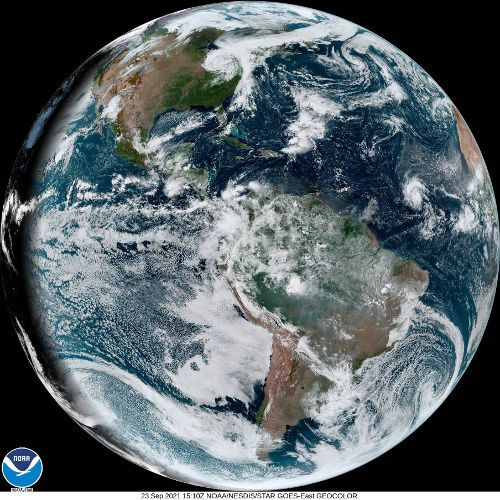

# goes-php

A web service for downloading and serving NOAA GOES imagery for live-ish background images. 

If you're unfamiliar, that's the Geostationary Operational Environmental Satellite.



## Requirements

* PHP 8
  * w/ Imagick extension
* SQLite3
* jpegoptim (optional)

## Install

### Composer:
```shell
$ composer create-project tholcomb/goes-php $INSTALL_DIR
```

### Manual:
```shell
# Download from releases or:
$ git clone https://github.com/tholcomb/goes-php.git $INSTALL_DIR

$ cd $INSTALL_DIR
$ composer install
$ php bin/console.php goes:install
```

## Setup

### File Permissions
These instructions assume php-fpm runs as the www-data user and that your account is a member of the www-data group. Adjust accordingly.
```shell
$ sudo chgrp -R www-data $INSTALL_DIR

# 2 is the setgid bit
$ chmod -R 2775 $INSTALL_DIR

# Remove execute permission applied in last step
$ find $INSTALL_DIR -type f -exec chmod 664 {} \; 
```

### crontab
This will cause the cron command to run every 5 minutes. Adjust to taste. This has the same assumptions as above.
```
*/5 * * * * www-data php $INSTALL_DIR/bin/console.php goes:cron
```

### nginx
```
server {
        ...
        root $INSTALL_DIR/public;

        location / {
                try_files $uri /index.php$is_args$args;
        }
        location ~ ^/index\.php(/|$) {
                fastcgi_pass unix:/var/run/php/php8.0-fpm.sock;
                fastcgi_split_path_info ^(.+\.php)(/.*)$;
                include fastcgi_params;
                fastcgi_param SCRIPT_FILENAME $realpath_root$fastcgi_script_name;
                fastcgi_param DOCUMENT_ROOT $realpath_root;
                internal;
        }
        location ~ \.php$ {
                return 404;
        }
}
```

## Usage

### Managing users
#### Add a user
```shell
$ php bin/console.php goes:user add
```
Then, follow the prompts. If you answer "yes" to the "Include time data" prompt, a timestamp and info from the original image will appear below Antarctica, otherwise, it will be cropped.  

NOTE: The API Key does not need to be secure. That is, unless your threat model includes extremely petty people who will research what obscure software you're using in order to mildly inconvenience you.
#### List users
```shell
$ php bin/console.php goes:user list
```
#### Remove user
```shell
$ php bin/console.php goes:user remove $API_KEY
```

### Getting images
Simply send a GET request to /latest.jpg with your API Key. The API Key can be included two ways:
1. As the GET parameter 'apiKey' (ex. /latest.jpg?apiKey=$API_KEY)
2. As the HTTP Header 'Api-Key' (ex. Api-Key: $API_KEY)

See [download_goes.php](examples/download_goes.php) for a working example.

#### iOS Shortcut
[iCloud link](https://www.icloud.com/shortcuts/0c7f939c8cb642a994e1fb4507d1f8fb)

## Limitations
These limitations are due to the base image URL being hardcoded. (Sue me.) If you're running up against these, feel free to email me or submit a pull request.
* Imagery is only available from the GOES-East satellite
* Screen sizes with dimensions above 1808px may suffer image degradation

## Acknowledgements
This project would not have been possible without the fine work done by the folks at the National Atmospheric & Oceanic Administration (NOAA), and more specifically, the National Environmental Satellite, Data, and Information Service (NESDIS) and the Center for Satellite Applications and Research (STAR). 

Send them your love! Preferably, in the form of a letter to your congressperson.